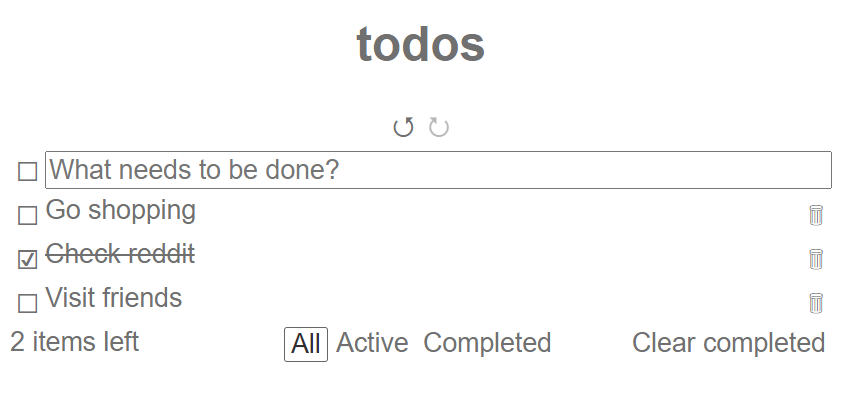

# vue-store-todo-app

Demo Todo MVC application for [https://github.com/Korijn/vue-store](https://github.com/Korijn/vue-store)

Live demo here: https://korijn.dev/vue-store-todo-app/index.html

## Try it

Clone the repo, and run:

```
npm install
npm run serve
```


